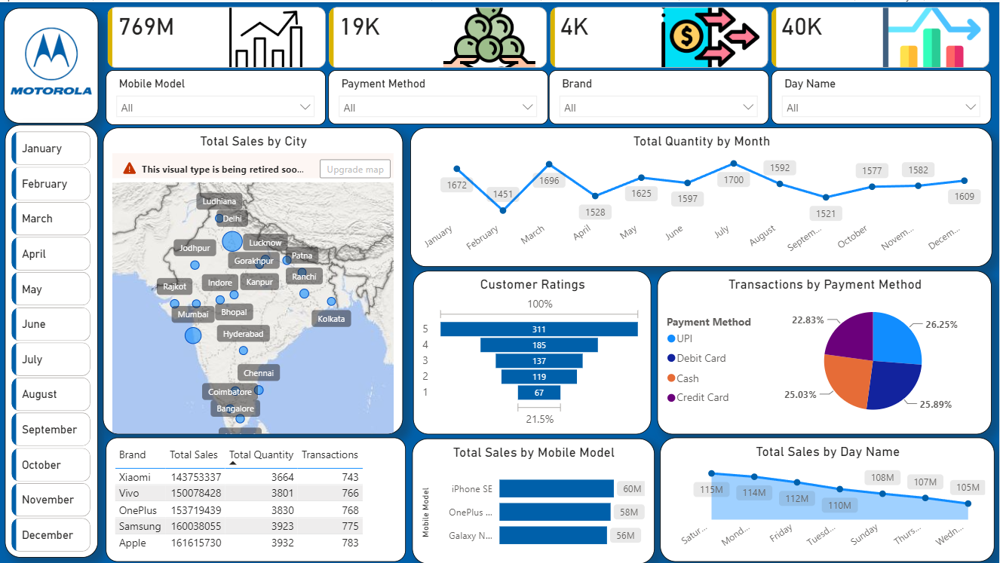

# 📱 Mobile Sales Analytics Dashboard | Power BI

An interactive **Power BI dashboard** for analyzing mobile phone sales across brands, models, cities, payment methods, and time periods.

## 📸 Dashboard Preview

## 📊 Project Overview

This project explores mobile sales data through an interactive **Power BI dashboard** designed to identify:

* Sales trends and patterns
* Top-performing brands and models
* Customer purchasing preferences
* City-wise sales performance
* Payment method usage
* Customer rating patterns

This project was developed as part of my hands-on learning in **Power BI, data visualization, and business intelligence**.

## 🛠️ Tools & Technologies

* **Microsoft Power BI Desktop** — Dashboard development and visualization
* **Power Query** — Data transformation and preparation
* **DAX** — Calculated measures and analytical metrics
* **Data Visualization** — Interactive charts, KPIs, slicers, and maps

## 📈 Dashboard Highlights

### Key Performance Indicators

* 💰 Total Sales
* 📦 Total Quantity
* 🔄 Total Transactions
* 💵 Average Sale Value

### Interactive Filters

* Brand
* Mobile Model
* Payment Method
* Month
* Day of Week

### Visual Analysis

* Monthly and daily sales trends
* Brand and model performance
* Payment method distribution
* City-wise sales analysis
* Weekly sales patterns
* Customer rating distribution
* Brand-level sales summary

## 💡 Business Questions Explored

* Which mobile brands and models generate the highest sales?
* Which cities contribute the most to overall sales?
* Which payment methods are most frequently used?
* How do sales change across different months and days?
* Which products have stronger customer ratings?
* How are sales and transaction volumes distributed across different regions?

## 📂 Project File

**PowerBI Project - Mobile Sales Dashboard.pbix**

Open the `.pbix` file using **Microsoft Power BI Desktop** to explore the dashboard interactively.

## 🚀 How to Explore

1. Download the `.pbix` file from this repository.
2. Open it using **Power BI Desktop**.
3. Use the available slicers and filters.
4. Interact with the dashboard visuals.
5. Explore the sales trends and business insights.

## 📚 Skills Practiced

* Power BI Dashboard Development
* Data Visualization
* Power Query
* DAX
* KPI Development
* Interactive Filtering
* Business Intelligence
* Data Analysis

---

⭐ **If you found this project useful, feel free to explore the repository and connect with me!**

